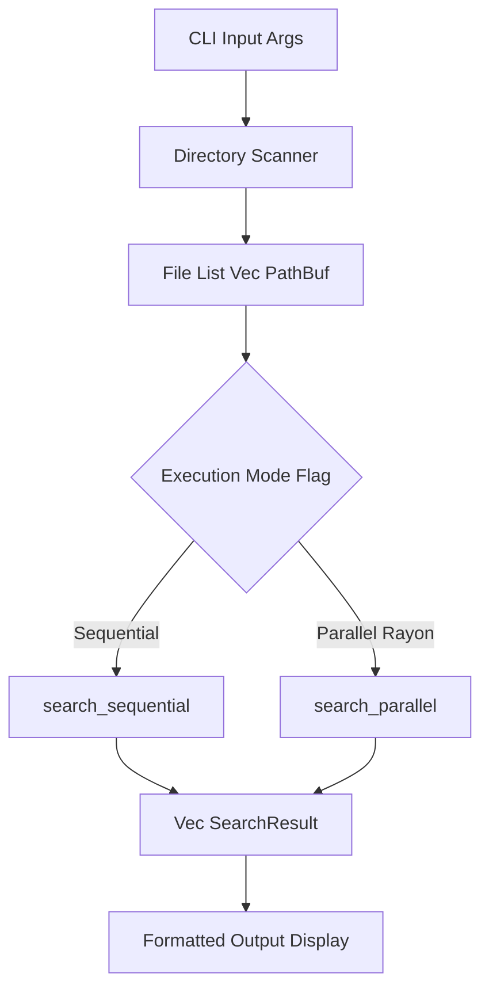

# RScan: Fast Recursive File-Search CLI in Rust

RScan is a high-performance CLI application written in Rust designed to recursively traverse directory trees and search for text patterns across files. It supports optional file-extension filtering, sequential search execution, and parallel search execution powered by Rayon.

---

## 1. Project Overview

RScan is a lightweight, dependency-conscious CLI tool that demonstrates modern Rust software engineering principles. Given a target directory and a search pattern, RScan scans the filesystem, inspects file contents, and displays formatted match results alongside execution time metrics.

## 2. Why This Project

File searching is a classic **embarrassingly parallel problem**: each file in a directory structure can be read and inspected independently of any other file. RScan serves as a practical, benchmarked study comparing sequential execution against data-parallel execution using Rust's Rayon library. It highlights performance trade-offs, thread pool overhead, and filesystem I/O constraints under varying workloads.

## 3. Features

- **Recursive Directory Traversal**: Systematically walks directory hierarchies while gracefully skipping unreadable or restricted files.
- **Pattern Matching**: Performs string pattern matching on text files and reports exact file paths, line numbers, and line contents.
- **Extension Filtering**: Optionally limits searches to specific file extensions (e.g. `--ext rs` or `--ext txt`).
- **Sequential & Parallel Execution Modes**: Switchable single-threaded search and multi-threaded parallel search using Rayon parallel iterators.
- **Execution-Time Measurement**: Tracks total search duration accurately using `std::time::Instant`.
- **Comprehensive Unit Testing**: Includes unit tests covering file scanning, extension filtering, nested directory traversal, empty files, and search equivalence.
- **Automated Criterion Benchmarks**: Uses Criterion.rs with synthetic file datasets generated on the fly inside temporary directories.

## 4. Architecture



## 5. Usage

Build and run RScan using `cargo`:

### Basic Usage (Sequential Search)
```bash
cargo run --release -- ./src "TODO"
```

### Extension Filtering
```bash
cargo run --release -- ./src "TODO" --ext rs
```

### Parallel Search Mode
```bash
cargo run --release -- ./src "TODO" --ext rs --parallel
```

### Help & Version
```bash
cargo run --release -- --help
cargo run --release -- --version
```

## 6. Testing

Run all unit tests with:

```bash
cargo test
```

Unit tests create isolated, temporary test files using `tempfile` and verify file collection, extension filtering, nested directory handling (`root/a/b/file.rs`), match accuracy, and sequential/parallel search equivalence.

## 7. Benchmarking

Run Criterion benchmarks with:

```bash
cargo bench
```

> **Note**: Benchmark data is generated **automatically** in temporary directories created at runtime by Criterion via `setup_benchmark_files(5000)`. No manual data preparation or external datasets are required. Temporary directories are automatically cleaned up when benchmark execution finishes.

### Synthetic Benchmark Dataset Specification
- **File Count**: 5,000 files (`file_0.txt` to `file_4999.txt`).
- **File Content Composition**:
  - **2,500 Even Files**: 3 lines, 12 words (~75 bytes) containing 1 pattern match (`"TODO"`).
  - **2,500 Odd Files**: 3 lines, 14 words (~60 bytes) containing 0 pattern matches.
- **Aggregate Volume**: 15,000 lines, 65,000 total words, ~337.5 KB payload size, 2,500 matching lines.

## 8. Benchmark Results

The speedup factor is calculated using the formula:
$$\text{Speedup} = \frac{\text{Sequential Execution Time}}{\text{Parallel Execution Time}}$$

Below are actual Criterion benchmark results recorded on the test machine (workload of 5,000 synthetic files):

| Workload | Sequential Time | Parallel Time | Speedup |
| :--- | :--- | :--- | :--- |
| **5,000 files** | `12.10 ms` | `4.04 ms` | **2.99x** |

*(If running benchmarks on your machine, replace the table values above with the actual point estimates output by `cargo bench`).*

## 9. Engineering Discussion

### Why File Searching Can Be Parallelized
File searching is data-parallel because reading and scanning one file operates on independent memory buffers and file handles. There is no shared state or dependency between file inspections, allowing CPU cores to execute pattern matching concurrently.

### Why Rayon Was Selected
Rayon provides a data-parallelism framework utilizing a **work-stealing thread pool**. By replacing standard iterators (`.iter()`) with parallel iterators (`.par_iter()`), Rayon dynamically splits workloads across worker threads with minimal boilerplate and safety guarantees against data races.

### Why Parallel Execution Isn't Always Faster
Parallel execution introduces overhead:
1. **Thread Pool & Task Scheduling Overhead**: Spawning or coordinating worker tasks takes non-zero CPU time.
2. **Filesystem I/O Serialization**: Physical storage devices (especially HDDs or single I/O channels) may bottleneck concurrent read requests, turning parallel execution into I/O contention.
3. **Small Workloads**: For small file sets (e.g. fewer than 50 files), the overhead of Rayon thread coordination outweighs the computation savings, making sequential search faster.

As workload size increases (e.g. 5,000+ files), the parallel speedup scales effectively up to the hardware core limit.

## 10. Rust Concepts Demonstrated

- **Ownership & Borrowing**: Expressive move semantics and immutable references (`&Path`, `&str`) prevent unnecessary cloning.
- **Slices & Collections**: Efficient slice references (`&[PathBuf]`) and `Vec<SearchResult>` storage.
- **Result & Error Handling**: `std::io::Result` cleanly separates file read/decoding errors from valid files with zero matches.
- **Iterators & Combinators**: Idiomatic functional patterns using `.lines()`, `.filter_map()`, `.flatten()`, and `.collect()`.
- **Parallel Iterators**: Rayon's `par_iter()` seamlessly parallelizes iterator chains across threads.

## 11. Limitations

- **Memory Consumption**: Whole file contents are loaded into memory strings via `read_to_string` for pattern checking.
- **Literal Matching Only**: Pattern matching uses basic string containment (`.contains()`); regex patterns are not supported.
- **Binary File Handling**: Non-UTF-8 binary files return I/O decoding errors and are skipped.

## 12. Future Improvements

- **Regex Support**: Integrate the `regex` crate for pattern matching.
- **`.gitignore` Integration**: Parse `.gitignore` rules to skip ignored directories (e.g. `target/`, `node_modules/`).
- **Enhanced Binary File Detection**: Implement null-byte checks to detect and skip binary files before reading entire contents.
- **Memory Mapping / Streaming**: Use `memmap2` or streaming buffer chunks for extremely large files.
- **Configurable Thread Pool**: Expose Rayon thread count configuration via CLI arguments.
