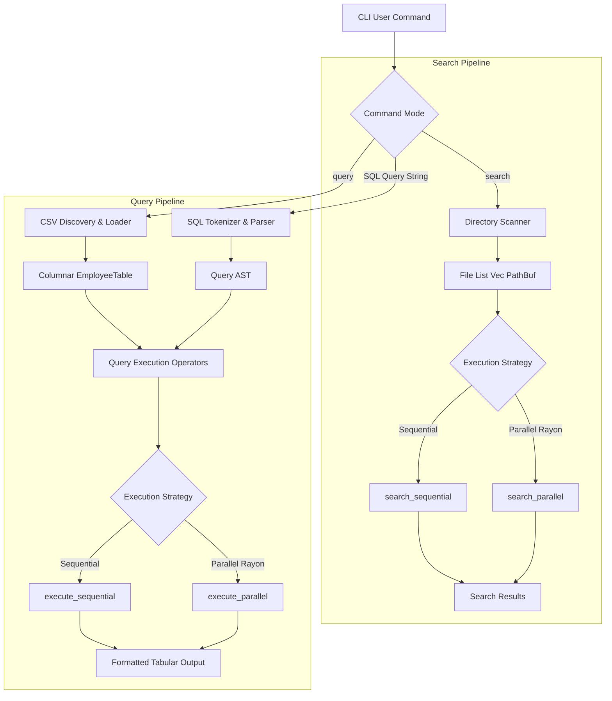

# RScan — Rust Local Analytics & Search Engine

RScan is a fast local data-processing engine and text-search CLI written in Rust. It combines recursive filesystem text search with a lightweight analytical query engine capable of parsing a SQL-like query language, transforming structured CSV datasets into a column-oriented memory layout, and executing filter, group-by, and aggregate operators sequentially or in parallel using Rayon.

---

## 1. Problem Statement

Modern data engineering and systems workflows often require scanning collections of local files or running analytical queries over medium-sized structured datasets (e.g. 1M+ rows) without the setup overhead of a heavyweight database system. RScan provides a zero-dependency, local-first engine in Rust designed to discover structured files, parse SQL-like queries into an AST, store dataset columns in contiguous vector buffers (`EmployeeTable`), and execute aggregations efficiently using CPU parallelism and cache-conscious column storage.

---

## 2. Why RScan?

File search and data analytics present two distinct performance profiles:
1. **Filesystem Text Search**: An I/O and compute-bound problem where parallelizing file inspections across threads delivers substantial wall-clock speedups.
2. **Columnar Analytical Query Execution**: A memory bandwidth and CPU cache-bound problem where contiguous column vector layouts eliminate unneeded field access and avoid cache line pollution.

RScan bridges both paradigms within a single Rust project, demonstrating systems engineering, query parsing, data layout optimization, and concurrency trade-offs.

---

## 3. Architecture



---

## 4. Search Engine

The search engine recursively scans directory trees for pattern matches across text files with optional extension filtering.

### Commands:
```bash
# Sequential text search
cargo run --release -- search ./src "TODO"

# Parallel text search with extension filter
cargo run --release -- search ./src "TODO" --ext rs --parallel
```

---

## 5. Analytical Query Engine

The analytical query engine discovers CSV files, loads data into contiguous columnar memory vectors (`EmployeeTable`), parses SQL-like queries into an AST, and executes filtering, grouping, and aggregations.

### Commands:
```bash
# Generate 1,000,000 synthetic employee records
cargo run --release --bin generate_data -- 1000000

# Run sequential analytical query
cargo run --release -- query ./data "SELECT department, SUM(salary) WHERE salary > 100000 GROUP BY department"

# Run parallel analytical query
cargo run --release -- query ./data "SELECT department, COUNT(*) WHERE salary > 100000 GROUP BY department" --parallel
```

---

## 6. Supported Query Syntax

RScan supports a structured SQL subset following the grammar:
`SELECT <expression_list> [WHERE <column> <operator> <literal>] [GROUP BY <column>]`

### Supported Expressions:
- Columns: `id`, `age`, `department`, `salary`, `experience`
- Aggregates: `SUM(column)`, `COUNT(*)`, `AVG(column)`
- Operators: `>`, `<`, `>=`, `<=`, `==`, `!=`

### Example Valid Queries:
```sql
SELECT department, SUM(salary) WHERE salary > 100000 GROUP BY department
SELECT department, COUNT(*) WHERE salary > 100000 GROUP BY department
SELECT department, AVG(salary) WHERE age >= 30 GROUP BY department
SELECT * WHERE salary > 120000
```

---

## 7. Dataset Generation

Benchmark and test data is generated deterministically using a built-in generator binary. No external datasets are required.

```bash
cargo run --release --bin generate_data -- 1000000
```

- Output: `data/employees.csv` (ignored in `.gitignore`)
- Schema: `id` (u64), `age` (u32), `department` (Enum), `salary` (f64), `years_experience` (u32)
- Deterministic PRNG algorithm ensures identical records across test runs.

---

## 8. Columnar Data Representation

Instead of row-oriented objects (`Vec<Employee>`), RScan stores dataset columns in contiguous vectors:

```rust
pub struct EmployeeTable {
    pub ids: Vec<u64>,
    pub ages: Vec<u32>,
    pub departments: Vec<Department>,
    pub salaries: Vec<f64>,
    pub experience: Vec<u32>,
}
```

### Why Columnar Storage Benefits Analytics:
1. **Selective Column Access**: Queries like `SELECT department, SUM(salary)` read only `departments` and `salaries`, skipping `id`, `age`, and `experience` entirely.
2. **Cache Locality**: Vector elements are contiguously packed in RAM, maximizing L1/L2 CPU cache line utilization during sequential scans.
3. **Reduced Data Movement**: Avoids pointer chasing and heap allocations associated with arrays of row structs.

---

## 9. Query Execution Pipeline

```
SQL String → Tokenizer → Parser → Query AST → Operator Evaluator → Tabular Result
```

1. **Tokenizer**: Scans SQL string into tokens (`SELECT`, `WHERE`, `GROUP`, `BY`, `SUM`, operators, identifiers).
2. **Parser**: Recursively constructs an AST (`Query { select, filter, group_by }`).
3. **Filter Operator**: Evaluates condition against column slices to produce matching row index vectors.
4. **Group-By & Aggregator**: Groups index vectors by key and computes `SUM`, `COUNT`, or `AVG`.

---

## 10. Sequential vs Parallel Execution

- **Sequential Mode**: Evaluates index filters and aggregations on a single CPU thread. Ideal for in-memory column array iterations where memory bandwidth is the primary constraint.
- **Parallel Mode (Rayon)**: Chunks the columnar table across Rayon worker threads, performing local sub-chunk filtering and merging group results across threads.

---

## 11. Benchmark Methodology

Benchmarks are executed via Criterion.rs under two independent workloads:
1. **Workload A (Filesystem Search)**: 5,000 synthetic text files in a `tempfile::TempDir`.
2. **Workload B (Analytical Query Execution)**: 1,000,000 employee records pre-allocated in memory outside measured iteration loops.

---

## 12. Benchmark Results

Measured empirical results recorded on test machine:

### Workload A: Filesystem Text Search (5,000 Synthetic Files)
| Mode | Execution Time | Speedup |
| :--- | :--- | :--- |
| **Sequential Search** | `13.22 ms` | Baseline |
| **Parallel Search (Rayon)** | `5.54 ms` | **2.38x** |

### Workload B: Analytical Query Execution (1,000,000 Rows)
Query: `SELECT department, SUM(salary) WHERE salary > 100000 GROUP BY department`

| Implementation & Mode | Execution Time | Speedup vs Row Baseline |
| :--- | :--- | :--- |
| **Row-Oriented Baseline (Sequential)** | `45.33 ms` | Baseline |
| **Columnar Parallel Execution (Rayon)** | `38.71 ms` | 1.17x |
| **Columnar Sequential Execution** | `27.17 ms` | **1.67x** |

### Key Performance Insights:
- **Columnar Layout Advantage**: Columnar sequential execution (`27.17 ms`) is **1.67x faster** than row-oriented baseline (`45.33 ms`) because only requested column vectors are loaded into CPU cache lines.
- **I/O vs Memory-Bound Trade-off**: Filesystem search is I/O-bound, so Rayon thread parallelism achieves **2.38x speedup**. In contrast, in-memory column array aggregation is memory-bandwidth bound, where sequential iteration maximizes cache hit rates and avoids Rayon task-scheduling overhead.

---

## 13. Rust Concepts Demonstrated

- **Ownership & Borrowing**: Efficient slice references (`&[usize]`, `&EmployeeTable`) prevent memory cloning.
- **Custom Enums & Structs**: `Department`, `SelectExpr`, `Operator`, `Query` AST.
- **Error Handling**: Idiomatic `Result<T, String>` for parsing and execution errors without panicking.
- **Parallel Iterators**: Rayon chunking and parallel reduction (`par_iter`).
- **Clean Architecture**: Decoupled scanning, parsing, columnar storage, and execution logic.

---

## 14. Error Handling

Handles invalid query syntax, unsupported column names, unreadable CSV files, and empty datasets gracefully with informative error messages.

---

## 15. Limitations

- **No SQL Joins or Subqueries**: Designed strictly for single-table analytical scans.
- **Memory Bound**: Entire CSV datasets are loaded into RAM columnar vectors.

---

## 16. Future Improvements

- **SIMD Vectorized Filtering**: Utilize SIMD instructions for faster numeric comparisons over column slices.
- **Memory Mapping (`memmap2`)**: Stream large CSV files directly from disk without loading full datasets into RAM.
